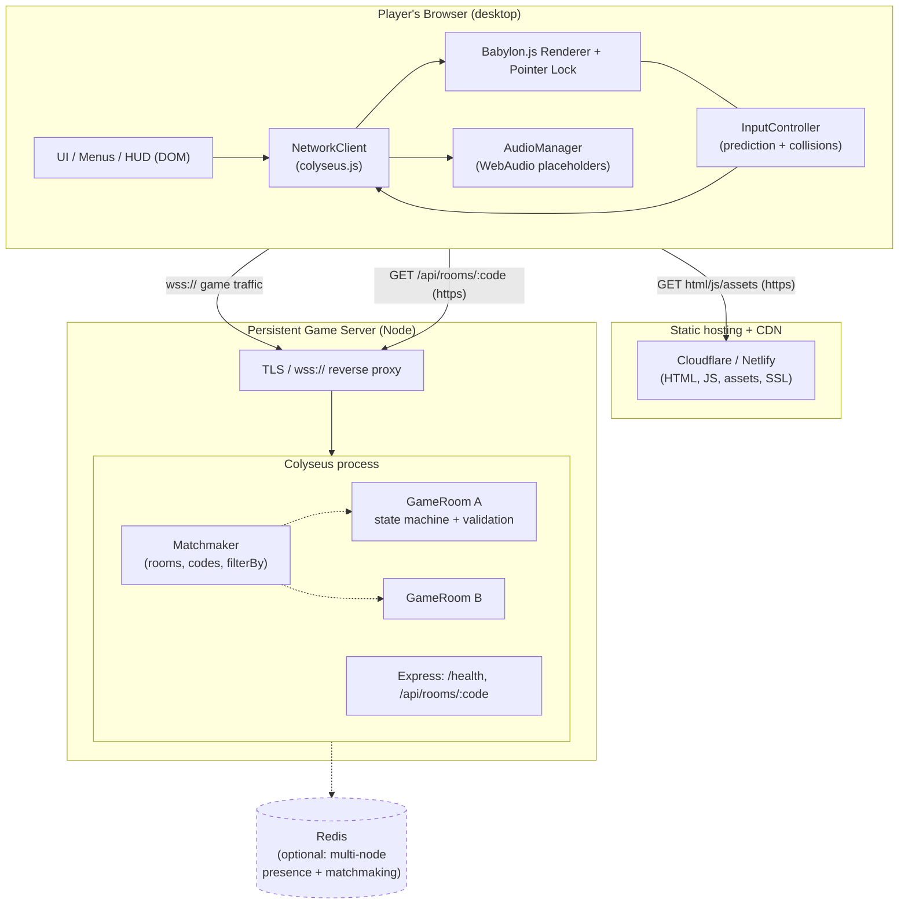
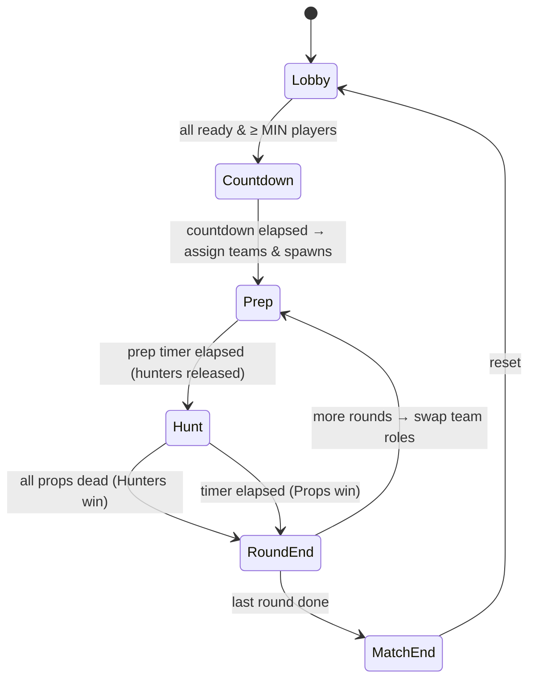

# MimicHunt — Architecture (Phase 1)

_A browser-based, authoritative-server multiplayer prop-hunt game. Original name,
art, maps, audio, and assets._

---

## 1. Realistic difficulty assessment

This is an **ambitious but achievable** solo/indie project. It is meaningfully
harder than a single-player web game because of three multiplying factors:

| Area | Difficulty | Why |
| --- | --- | --- |
| Real-time netcode | High | Authoritative simulation, movement validation, lag handling, reconnection. This is the hard 40%. |
| 3D web rendering | Medium | Engines do the heavy lifting; the work is content, LODs, and staying at 60 FPS. |
| Prop-hunt game logic | Medium | Round state machine, team swaps, disguise validation, fair hunter penalties. |
| Anti-cheat | Medium–High | Never trust the client; validate every message. Realistically "good enough," never perfect. |
| Art / audio | Medium | Original assets take time. Placeholders get you playable; polish is ongoing. |
| Deployment / ops | Medium | Persistent WebSocket servers are not serverless-friendly; you need a real host. |

Honest expectations: a **fun 2–8 player prototype in days**, a **polished 8–16
player game in weeks to a few months** depending on time invested. The single
biggest risk is scope creep — the phased plan below exists to fight that.

The good news: the prototype in this repo already runs, is authoritative, and is
verified end-to-end (server integration test + headless-browser test both green).

---

## 2. Recommended technology stack (and why)

**Recommendation: Babylon.js + Colyseus + Vite + TypeScript, deployed as a
static client (Cloudflare/Netlify) + a persistent Node game server (Fly.io /
Railway / a VPS).**

### Client engine: Babylon.js (over Three.js / PlayCanvas / Unity WebGL)

| Criterion | Babylon.js | Three.js | PlayCanvas | Unity WebGL |
| --- | --- | --- | --- | --- |
| Multiplayer support | Neutral (engine-agnostic) | Neutral | Neutral | Awkward (WebGL export, heavy) |
| Browser performance | Very good (WebGL2/WebGPU) | Very good | Very good | Heaviest; big downloads, slow start |
| Visual quality | High (PBR, GUI, post) | High (assemble yourself) | High | Highest, but overkill here |
| Deployment complexity | Low (JS bundle) | Low | Low–Med (editor lock-in) | High (large WASM/data) |
| Dev speed | **High — batteries included** | Medium (DIY physics/GUI/assets) | High (but editor-centric) | Medium |
| Server authority | Fully in your control | Fully in your control | In your control | Fights you |
| Asset workflow | glTF-first, good tools | glTF, DIY | Cloud editor | Unity native |
| Hosting cost | Low (static) | Low | Low–Med | Higher (bandwidth) |
| Maintainability | High (TS-first, one lib) | High | Medium (proprietary) | Medium |

**Why Babylon over Three.js specifically:** for a solo dev building a whole game
(not a graphics demo), Babylon ships the things you'd otherwise bolt onto Three
yourself — a collision system, animation, a GUI layer, an asset manager, glTF
loading, and an in-browser inspector. That directly reduces the amount of custom
code and bugs. Three.js is an excellent choice too and the porting cost is low
because **all game logic lives in the shared/server layer, not the renderer** —
if you ever want to swap, only the client rendering files change.

**Why not Unity WebGL:** multi-megabyte downloads, slow cold starts, and a
runtime that fights browser-native authority patterns. Wrong tool for a
lightweight, instantly-loadable browser game.

### Netcode: Colyseus (over Socket.IO / raw WebSockets)

Colyseus is purpose-built for **authoritative, room-based** multiplayer:

- Rooms, room lifecycle, and matchmaking primitives out of the box.
- **Schema-based state sync** with automatic binary delta encoding — you mutate
  server state, clients receive only what changed. This is exactly the model a
  prop-hunt needs (many players, small frequent updates).
- A clean server authority model: clients send _messages_, the server owns _state_.
- Reconnection support (`allowReconnection`) and a pluggable Redis driver/presence
  for horizontal scaling later.

Raw WebSockets/Socket.IO would mean hand-writing all of that (state diffing,
interest management, room registry, reconnection) — weeks of undifferentiated work.

### Physics: Babylon built-in collisions now, Havok later

The prototype uses Babylon's built-in **ellipsoid collision** system (no WASM,
instant load) for FPS movement — plenty for a flat-floored warehouse. When maps
get vertical/complex, drop in **Havok** (`@babylonjs/havok`, official, WASM) for
proper rigid-body physics. The server does **not** run a full physics engine; it
does cheap geometric validation (speed caps, bounds, ray-cylinder hitscan), which
is the right cost/benefit for this genre.

### Build & tooling

- **Vite** for the client (fast dev server, HMR, easy production bundles).
- **TypeScript everywhere**, `strict` on, with a shared package as the single
  source of truth for constants, enums, and message shapes.
- **npm workspaces** monorepo (no extra tooling needed).
- **Docker** for the server so any host can run it identically.

---

## 3. System architecture



**Two hosts, one mental model that trips people up:** the **website/client is
static files** (cache them on a CDN, scale to infinity, near-zero cost) while the
**game server is a long-lived stateful process holding open WebSocket
connections** (cannot be serverless; needs a host that keeps a process alive).
They are deployed and scaled completely differently. See §8.

---

## 4. Networking & synchronization strategy

**Authority:** the server is the single source of truth. Clients send _intent_
(`input`, `shoot`, `transform`, `reload`, `taunt`); the server mutates the
authoritative `GameState` schema; Colyseus streams binary deltas back.

**Movement (hybrid client-predicted, server-validated):**

1. Client simulates its own movement locally each frame (Babylon collisions) for
   zero-latency feel and sends a position snapshot at 20 Hz.
2. Server validates each snapshot: max horizontal step = `sprintSpeed · dt ·
   tolerance` (rejects speed hacks/teleports by **clamping**, not trusting), plus
   a hard map-bounds and Y-range clamp (rejects out-of-map/fly hacks).
3. Client **reconciles**: it only snaps to the server position when it has clearly
   diverged (> 2 m), so normal play is smooth but cheating is corrected.

This is the pragmatic middle ground. Full server-side movement simulation with
rollback is a Phase 4+ upgrade; the message contracts already support it.

**Combat is fully server-authoritative:** the client sends a ray (origin + dir).
The **server** performs the hitscan (ray vs. vertical cylinders for disguised
players and for world furniture), applies damage, decides eliminations, and
enforces fire-rate + ammo. The client only _renders_ the result. A client can
never declare a kill.

**State rates:** simulation 20 Hz, state patches ~15 Hz, client input 20 Hz —
tunable in `packages/shared/src/constants.ts`. Colyseus delta-encodes, so idle
players cost almost nothing.

**Game-state model (authoritative schema):**

- `GameState`: `phase`, `round`, `roundsPerMatch`, `phaseEndsAt`, `mapId`,
  `propsScore`, `huntersScore`, `lastResult`, `players: Map<sessionId, Player>`.
- `Player`: identity (`id`, `name`, `team`, `ready`, `connected`), transform
  (`x,y,z,ry,rp,moving`), life (`health`, `alive`, `ammo`, `reloading`), disguise
  (`propModel`, `rotationLocked`), and `score`, `ping`.

**Round state machine (server-owned):**



---

## 5. Folder structure

```
hunt_game/
├─ package.json                # npm workspaces root + scripts
├─ tsconfig.base.json
├─ docker-compose.yml          # local server (+ optional redis)
├─ docs/
│  ├─ ARCHITECTURE.md          # this file
│  └─ ASSETS.md                # how to replace placeholder audio/models
├─ tests/
│  ├─ smoke.mjs                # server integration test (2 headless clients)
│  └─ e2e.mjs                  # Playwright browser test (2 tabs, full match)
└─ packages/
   ├─ shared/                  # NO runtime deps — imported by client AND server
   │  └─ src/{constants,types,maps,index}.ts
   ├─ server/                  # authoritative Colyseus server
   │  ├─ Dockerfile
   │  └─ src/
   │     ├─ index.ts           # Express + Colyseus + wss transport
   │     ├─ rooms/GameRoom.ts   # state machine + all validation + combat
   │     ├─ schema/GameState.ts # replicated @schema classes
   │     └─ utils/roomCode.ts   # crypto-random room codes
   └─ client/                  # Vite + Babylon.js + colyseus.js
      ├─ index.html
      └─ src/
         ├─ main.ts            # orchestration + feature detection
         ├─ net/NetworkClient.ts
         ├─ game/{GameScene,InputController,mapBuilder}.ts
         ├─ ui/{Screens,HUD}.ts
         └─ audio/AudioManager.ts
```

**Rule:** anything both sides must agree on (tuning numbers, enums, message
names, map/prop data) lives in `packages/shared` and nowhere else.

---

## 6. Performance strategy

- **Stylized, not photoreal:** flat/PBR materials, clean lighting, strong
  silhouettes. Cheaper _and_ prettier-per-watt than chasing realism.
- **Draw-call discipline:** shared materials (already cached by color), instancing
  for repeated props, merge static geometry per map.
- **LODs + culling:** Babylon frustum culling is automatic; add distance LODs and
  occlusion when maps grow.
- **Bundle size:** the prototype imports the Babylon barrel (~1.1 MB gzip). Phase 3
  switches to per-module imports (`@babylonjs/core/...`) + `manualChunks` to
  tree-shake and code-split, and lazy-loads maps/audio.
- **Network:** delta-encoded state, low patch rate, interest management later
  (don't sync a prop's exact transform to a hunter across the map).
- **Targets:** 60 FPS on modern desktop, acceptable on integrated GPUs, fast first
  load via CDN + progressive asset loading.

---

## 7. Security & anti-cheat strategy

Implemented in the prototype:

- **Server authority** over movement, shooting, damage, elimination, timers, teams.
- **Movement validation:** per-tick speed cap (anti speed-hack), bounds + Y clamp
  (anti-teleport / anti-fly). _Verified by automated test._
- **Fire-rate + ammo** enforced server-side; **damage/kills computed server-side**
  (client cannot fake a hit). Wrong-target shots self-penalize.
- **Disguise validation:** only whitelisted, `disguiseAllowed` map props, and only
  when the player is physically near that object.
- **Secure room codes:** `crypto.randomInt`, ambiguous characters excluded.
- **Message hygiene:** payload shape/type checks, name sanitization, per-client
  **rate limiting** (anti-spam / basic DoS).
- **Team/phase gating:** e.g. only hunters shoot, only during Hunt; props frozen
  hunters during Prep.

Phase 4 hardening: JSON schema validation on every message (zod/@colyseus schema
guards), stricter reconciliation (server-owned movement), connection-rate limits
at the proxy, and telemetry to flag anomalies. No secrets ever ship to the client.

---

## 8. Deployment & hosting

**Client (static):** `npm run build` → upload `packages/client/dist` to
**Cloudflare Pages / Netlify / Vercel static**. Free tier is plenty; the CDN gives
you SSL, caching, and global edge for near-zero cost. Set `VITE_SERVER_URL` to
your `wss://` game domain at build time.

**Game server (persistent):** build the Docker image and run it on a host that
keeps a **long-lived process with open WebSockets**: **Fly.io, Railway, Render
(web service, not serverless), or a small VPS** (Hetzner/DigitalOcean). Put it
behind TLS so the browser can use `wss://` (required when the site is `https://`).
Options: the platform's built-in TLS (Fly/Railway/Render) or Caddy/Nginx/Cloudflare
in front of a VPS.

> **Do not** put the game server on serverless/edge functions. They don't hold
> persistent WebSocket sessions or in-memory room state.

**DNS:** `game.yourdomain.com` → game server (proxied or direct-with-TLS);
`yourdomain.com` / `www` → static host. **Env vars:** `PORT`, `NODE_ENV`,
`CORS_ORIGIN` (your real site origin) on the server; `VITE_SERVER_URL` on the
client build. **Scaling:** start single-process (fine for dozens of concurrent
rooms). To go multi-node, add the **Redis** driver + presence so matchmaking and
the code→room lookup work cluster-wide, and run several server instances behind
the proxy. **Logging/monitoring:** ship stdout to the platform's logs; add
`/health` checks (already present), and later Prometheus/Grafana or a hosted APM.
**Backups:** none needed until you add a database (leaderboards/accounts) — then
back up Postgres on a schedule.

Estimated cost to launch: **client ≈ $0**, **game server ≈ $5–15/mo** for a small
instance handling the first players. Scale spend only when concurrency demands it.

---

## 9. Roadmap & milestones

- **Phase 1 — Architecture (this doc): done.**
- **Phase 2 — Minimum playable prototype: implemented & verified in this repo.**
  Rooms/codes/matchmaking, two teams, FPS movement, disguise, server hitscan,
  damage/elimination, round timer + team swap, HUD, scoreboard.
- **Phase 3 — Visual & feel polish:** Babylon module imports + code-split, shadows,
  better materials/lighting, glTF prop models, animations, real audio, richer map,
  loading screen, VFX (muzzle, tracers, hit decals).
- **Phase 4 — Production readiness:** public matchmaking UX, robust reconnection,
  full spectator, settings, perf profiling, hardened anti-cheat, Docker deploy,
  monitoring/error reporting, automated tests in CI.

**Next concrete milestone (start of Phase 2 continuation):** wire disguise + lock
+ taunt polish, add sprint, add a proper spectator free-cam, and tune round
pacing — all testable in isolation against the existing server.
